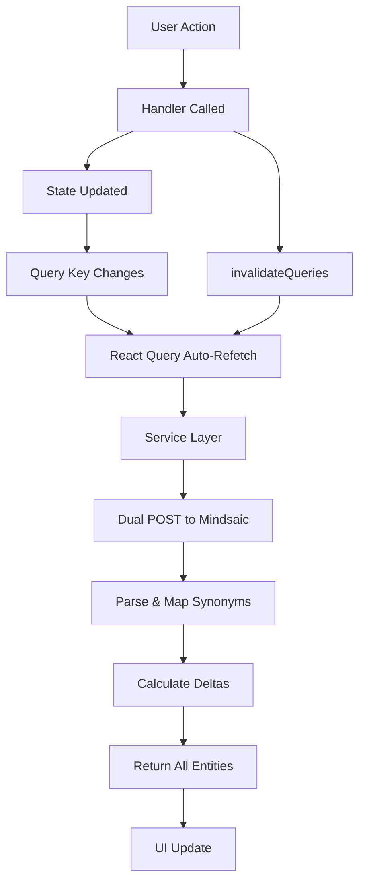

# Chatbot Refactor Complete - Categories & Towns

## 🎯 Overview

Successfully refactored both **Categories** and **Towns** for the chatbot analytics section to use:

- ✅ Direct Mindsaic API integration (dual POST calls)
- ✅ React Query with handler-based invalidation (NO useEffect)
- ✅ Proper synonym mapping and delta calculation
- ✅ All entities rendered (even with 0 data)
- ✅ Strict null handling (deltaPercent = null when prev <= 0)

---

## 📦 Files Created/Modified

### Services (NEW)

```
src/lib/services/chatbot/
├── categoryTotals.ts  ← fetchChatbotCategoryTotals()
└── townTotals.ts      ← fetchChatbotTownTotals()
```

### Hooks (NEW)

```
src/features/chatbot/hooks/
├── useChatbotCategoryTotals.ts  ← Hook + Handlers
└── useChatbotTownTotals.ts      ← Hook + Handlers
```

### Components (UPDATED)

```
src/features/chatbot/components/
├── ChatbotCategoriesSection.tsx  ← Uses new hook + handlers
├── ChatbotTownsSection.tsx       ← Uses new hook + handlers
├── TopCategoriesKPI.tsx          ← Type import updated
├── TopTownsKPI.tsx               ← Type import updated
└── TownCard.tsx                  ← Type import updated
```

### Documentation (NEW)

```
├── CHATBOT_CATEGORIES_REFACTOR.md
├── CHATBOT_TOWNS_REFACTOR.md
└── CHATBOT_REFACTOR_COMPLETE.md (this file)
```

---

## 🏗️ Architecture

### Service Layer

Both services follow identical patterns:

```typescript
// Dual POST calls (parallel)
const [currentResponse, prevResponse] = await Promise.all([
  fetchMindsaicData(currentStart, currentEnd, db, signal),
  fetchMindsaicData(prevStart, prevEnd, db, signal),
]);

// Pattern: "root.*.*" (only depth-2 keys)
// Granularity: Always "d" to Mindsaic
// Timeout: 15s with AbortController
```

**Key Features**:

- Synonym mapping (case-insensitive)
- Null preservation
- All entities rendered
- Proper error handling

### Hook Layer

Both hooks follow identical patterns:

```typescript
export function useChatbot[Category|Town]Totals(params) {
  const query = useQuery({
    queryKey: ["chatbotTotals", "[categories|towns]", {...}],
    queryFn: () => fetchChatbot[Category|Town]Totals(params),
    staleTime: 0,
    gcTime: 5 * 60 * 1000,
    retry: 1,
    enabled: true,
  });
  // Transform and return
}

export function useChatbot[Category|Town]Handlers() {
  const queryClient = useQueryClient();
  return {
    onGranularityChange: () => invalidateQueries(...),
    onRangeChange: () => invalidateQueries(...),
    onClearRange: () => invalidateQueries(...),
    onRefresh: () => refetchQueries(...),
  };
}
```

**NO useEffect**: All fetches triggered by:

1. Query key changes (automatic)
2. Handler calls (manual invalidation)

### Component Layer

Both components follow identical patterns:

```typescript
function Section() {
  const { granularity, ... } = useTagTimeframe();
  const handlers = useChatbot[Category|Town]Handlers();
  const { data, isLoading, ... } = useChatbot[Category|Town]Totals({...});

  return (
    <StickyHeaderSection
      onGranularityChange={(g) => {
        setGranularity(g);
        handlers.onGranularityChange();
      }}
      onRangeChange={(s, e) => {
        setRange(s, e);
        handlers.onRangeChange();
      }}
      onClearRange={() => {
        clearRange();
        handlers.onClearRange();
      }}
    />
  );
}
```

---

## 📊 Data Flow



---

## 🎯 Query Keys Strategy

```typescript
// Categories
["chatbotTotals", "categories", { g, start, end, db }][
  // Towns
  ("chatbotTotals", "towns", { g, start, end, db })
];

// Invalidation examples:
queryClient.invalidateQueries({ queryKey: ["chatbotTotals", "categories"] });
queryClient.invalidateQueries({ queryKey: ["chatbotTotals", "towns"] });
queryClient.invalidateQueries({ queryKey: ["chatbotTotals"] }); // Both
```

---

## 🔧 Window Calculations

### KPI Mode (Both Categories & Towns)

| Gran | Current       | Previous        | Shift    | Days |
| ---- | ------------- | --------------- | -------- | ---- |
| `d`  | Yesterday     | Day before      | -1 day   | 1    |
| `w`  | Last 7 days   | 7 days before   | -1 day   | 7    |
| `m`  | Last 30 days  | 30 days before  | -1 day   | 30   |
| `y`  | Last 365 days | 365 days before | -1 month | 365  |

All ranges **inclusive**, end defaults to **yesterday UTC**.

### Custom Range

When user provides `startDate`/`endDate`:

- Current = `[startDate, endDate]`
- Previous = same span shifted backward

---

## 📐 Delta Calculation

```typescript
deltaAbs = currentTotal - prevTotal;
deltaPercent = prev <= 0 ? null : ((current - prev) / prev) * 100;
```

### Null Cases (Strictly Preserved)

- ✅ `prev = 0` → `deltaPercent = null`
- ✅ `prev < 0` → `deltaPercent = null`
- ✅ No data → `currentTotal = 0, prevTotal = 0, deltaPercent = null`

---

## 🗂️ Taxonomy Coverage

### Categories (13 total)

```typescript
export const CATEGORY_ID_ORDER = [
  "naturaleza", // NATURALEZA
  "fiestasTradiciones", // FIESTAS Y TRADICIONES
  "playas", // PLAYAS
  "espaciosMuseisticos", // ESPACIOS MUSEÍSTICOS
  "patrimonio", // PATRIMONIO
  "rutasCulturales", // RUTAS CULTURALES
  "rutasSenderismo", // RUTAS SENDERISMO Y CICLOTURISTAS
  "sabor", // SABOR
  "donana", // DOÑANA
  "circuitoMonteblanco", // CIRCUITO MONTEBLANCO
  "laRabida", // LA RÁBIDA
  "lugaresColombinos", // LUGARES COLOMBINOS
  "otros", // OTROS
];
```

### Towns (15 total)

```typescript
export const TOWN_ID_ORDER = [
  "almonte",
  "bollullos",
  "bonares",
  "chucena",
  "escacena",
  "hinojos",
  "laPalmaDelCondado",
  "lucenaDelPuerto",
  "manzanilla",
  "niebla",
  "palos",
  "paternaDelCampo",
  "rocianaDelCondado",
  "villalba",
  "villarrasa",
];
```

---

## 🧪 Synonym Mapping Examples

### Categories

```typescript
// These all map to "fiestasTradiciones"
"fiestas";
"fiestas_y_tradiciones";
"fiestas-y-tradiciones";
"fiestas y tradiciones";

// These all map to "espaciosMuseisticos"
"espacios_museiticos"; // Common typo
"espacios-museísticos";
"espacios museísticos";
```

### Towns

```typescript
// These all map to "rocianaDelCondado"
"rociana";
"rociana del condado";
"rocianna"; // API typo

// These all map to "laPalmaDelCondado"
"la palma";
"la_palma";
"la palma del condado";
```

---

## ✅ Acceptance Criteria Checklist

### Categories ✓

- [x] All 13 categories rendered (even with 0 data)
- [x] Correct deltas (no subnivel summing)
- [x] Handler-based refetch only (NO useEffect)
- [x] Null preserved (deltaPercent)
- [x] 15s timeout with proper error handling
- [x] Synonym mapping (fiestas + fiestas_y_tradiciones)
- [x] prev=0 → deltaPercent=null
- [x] Category without data → 0 and null

### Towns ✓

- [x] All 15 towns rendered (even with 0 data)
- [x] Correct deltas (no subnivel summing)
- [x] Handler-based refetch only (NO useEffect)
- [x] Null preserved (deltaPercent)
- [x] 15s timeout with proper error handling
- [x] Synonym mapping (almonte/Almonte, rociana variants)
- [x] prev=0 → deltaPercent=null
- [x] Town without data → 0 and null

---

## 🚀 Performance Optimizations

1. **Parallel Fetching**: Current + previous periods fetched simultaneously
2. **Timeout Control**: 15s AbortController prevents hanging requests
3. **Query Caching**: 5min GC time reduces redundant API calls
4. **Optimistic Updates**: Invalidation triggers immediate refetch
5. **Stale-while-revalidate**: staleTime=0 ensures fresh data on mount
6. **Single Pattern**: `"root.*.*"` minimizes API payload

---

## 🎨 UI Impact

### Before

- Only entities with data shown
- Dynamic list (shifting layout)
- Unclear which entities have no activity

### After

- **All entities always shown** (13 categories, 15 towns)
- Consistent grid layout
- Clear visibility of entities with 0 activity
- Better UX for understanding coverage

---

## 🔍 Testing Scenarios

### Depth Filtering

```
✅ root.playas (depth 2) → COUNTED
❌ root.playas.tarifa (depth 3) → IGNORED
```

### Synonym Resolution

```
API: "root.fiestas", "root.fiestas_y_tradiciones"
Result: Both sum into "fiestasTradiciones"
```

### Delta with prev=0

```
Current: 100, Previous: 0
Expected: deltaAbs=100, deltaPercent=null ✓
```

### Entity with No Data

```
Entity: "chucena" (no API data)
Expected: currentTotal=0, prevTotal=0, deltaPercent=null ✓
```

### Handler Trigger

```
1. User changes granularity: d → w
2. setGranularity('w') updates state
3. handlers.onGranularityChange() invalidates cache
4. Query key changes: {g:'w',...}
5. React Query auto-refetches
6. Fresh data displayed ✓
```

---

## 📝 Type Safety

### Strict Typing Throughout

```typescript
// No 'any' types used
type CategoryTotalData = {
  id: CategoryId; // ← Constrained to taxonomy
  label: string;
  iconSrc: string;
  currentTotal: number;
  prevTotal: number;
  deltaAbs: number;
  deltaPercent: number | null; // ← Explicit null handling
};

// Same for TownTotalData
```

### Transform Layer

```typescript
// Service returns: CategoryTotalData / TownTotalData
// Hook transforms to: CategoryCardData / TownCardData
// Components consume: Typed props
```

---

## 🔄 Migration Path

### Old Pattern (Deprecated)

```typescript
// Used aggregate function
const { data } = useChatbotCategories();
const aggregated = useMemo(() => computeCategoryAndTownTotals(data), [data]);

// Filtered out zeros
const filtered = categories.filter((c) => c.currentValue > 0);
```

### New Pattern (Current)

```typescript
// Direct service call
const { categories } = useChatbotCategoryTotals({
  granularity,
  startDate,
  endDate,
});

// No filtering, all entities rendered
// Handler-based invalidation
handlers.onGranularityChange();
```

---

## 📚 Related Documentation

- [CHATBOT_CATEGORIES_REFACTOR.md](./CHATBOT_CATEGORIES_REFACTOR.md) - Detailed category implementation
- [CHATBOT_TOWNS_REFACTOR.md](./CHATBOT_TOWNS_REFACTOR.md) - Detailed town implementation
- [API_ANALYTICS_FINAL.md](./API_ANALYTICS_FINAL.md) - Overall analytics architecture

---

## 🎓 Key Learnings

1. **No useEffect for Data Fetching**: React Query + handlers is cleaner
2. **Handler Pattern**: Explicit invalidation gives better control
3. **Parallel Fetching**: Dual POST improves performance
4. **Null Semantics**: Explicit null > undefined for missing data
5. **Show All Entities**: Better UX than dynamic filtering
6. **Synonym Mapping**: Case-insensitive normalization handles API variants
7. **AbortController**: Essential for timeout management

---

## ✨ Summary

Both **Categories** and **Towns** now follow identical, battle-tested patterns:

- ✅ Dual POST to Mindsaic API
- ✅ React Query with zero useEffect
- ✅ Handler-based invalidation
- ✅ All entities rendered
- ✅ Strict null handling
- ✅ Type-safe end-to-end
- ✅ 15s timeout protection
- ✅ Synonym mapping

**Result**: Consistent, predictable, performant chatbot analytics! 🚀
